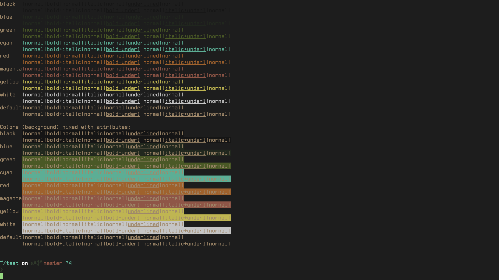

# Owly Kitty

Kitty theme based on my Neovim colourscheme [owly.nvim](https://github.com/OwlfaceGames/owly.nvim).



### Matching Neovim & Tmux Theme

- For the matching Neovim theme see [owly.nvim](https://github.com/OwlfaceGames/owly.nvim)
- For the matching Tmux theme see [owly.kitty](https://github.com/OwlfaceGames/owly.tmux)

### Note

For the best experience with this theme use [starship](https://starship.rs/) and [promptly](https://github.com/OwlfaceGames/promptly), my prompt theme manager. In promptly select starship then owly, that is my exact terminal config.

This kitty theme is not great without a custom prompt as the colourscheme is centered around getting the experience I want out of the tui apps I use.

## Installation

### Manual Installation

1. Download the `owly.conf` file from this repository
2. Copy it to your Kitty configuration directory:
   ```bash
   # On macOS/Linux
   cp owly.conf ~/.config/kitty/
   
   # On macOS (alternative location)
   cp owly.conf ~/Library/Preferences/kitty/
   ```
3. Include the theme in your `kitty.conf`:
   ```
   include owly.conf
   ```
4. Reload Kitty configuration: `Ctrl+Shift+F5` (or `Cmd+Shift+F5` on macOS)

### Using Kitty Themes Kitten

If you have the `kitty-themes` repository cloned:

```bash
# Clone the theme into your kitty themes directory
git clone https://github.com/owlfacegames/owly.kitty ~/.config/kitty/themes/owly
```

## Support
If you like my work, consider supporting me through [GitHub Sponsors](https://github.com/sponsors/OwlfaceGames)🩷
